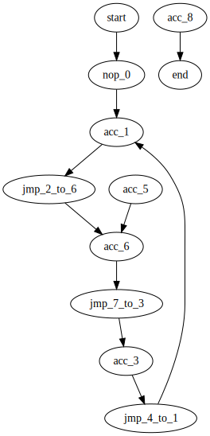
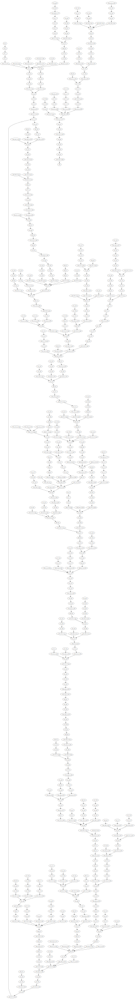

# Day 8: Handheld Halting

Your flight to the major airline hub reaches cruising altitude without incident. While you consider checking the in-flight menu for one of those drinks that come with a little umbrella, you are interrupted by the kid sitting next to you.

Their [handheld game console](https://en.wikipedia.org/wiki/Handheld_game_console) won't turn on! They ask if you can take a look.

You narrow the problem down to a strange **`infinite loop`** in the boot code (your puzzle input) of the device. You should be able to fix it, but first you need to be able to run the code in isolation.

The boot code is represented as a text file with one **`instruction`** per line of text. Each instruction consists of an **`operation`** (`acc`, `jmp`, or `nop`) and an **`argument`** (a signed number like `+4` or `-20`).

- `acc` increases or decreases a single global value called the **`accumulator`** by the value given in the argument. For example, `acc +7` would increase the accumulator by 7. The accumulator starts at `0`. After an `acc` instruction, the instruction immediately below it is executed next.
- `jmp` **`jumps`** to a new instruction relative to itself. The next instruction to execute is found using the argument as an **`offset`** from the `jmp` instruction; for example, `jmp +2` would skip the next instruction, `jmp +1` would continue to the instruction immediately below it, and `jmp -20` would cause the instruction 20 lines above to be executed next.
- `nop` stands for **`No OPeration`** - it does nothing. The instruction immediately below it is executed next.

For example, consider the following program:
```
nop +0
acc +1
jmp +4
acc +3
jmp -3
acc -99
acc +1
jmp -4
acc +6
```

These instructions are visited in this order:
```
nop +0  | 1
acc +1  | 2, 8(!)
jmp +4  | 3
acc +3  | 6
jmp -3  | 7
acc -99 |
acc +1  | 4
jmp -4  | 5
acc +6  |
```

First, the `nop +0` does nothing. Then, the accumulator is increased from 0 to 1 (`acc +1`) and `jmp +4` sets the next instruction to the other `acc +1` near the bottom. After it increases the accumulator from 1 to 2, `jmp -4` executes, setting the next instruction to the only `acc +3`. It sets the accumulator to 5, and `jmp -3` causes the program to continue back at the first `acc +1`.

This is an **`infinite loop`**: with this sequence of jumps, the program will run forever. The moment the program tries to run any instruction a second time, you know it will never terminate.

Immediately **`before`** the program would run an instruction a second time, the value in the accumulator is **`5`**.

Run your copy of the boot code. Immediately before any instruction is executed a second time, **`what value is in the accumulator?`**

# Part Two

After some careful analysis, you believe that **`exactly one instruction is corrupted`**.

Somewhere in the program, **`either`** a `jmp` is supposed to be a `nop`, **`or`** a `nop` is supposed to be a `jmp`. (No `acc` instructions were harmed in the corruption of this boot code.)

The program is supposed to terminate by **`attempting to execute an instruction immediately after the last instruction in the file`**. By changing exactly one `jmp` or `nop`, you can repair the boot code and make it terminate correctly.

For example, consider the same program from above:
```
nop +0
acc +1
jmp +4
acc +3
jmp -3
acc -99
acc +1
jmp -4
acc +6
```

If you change the first instruction from `nop +0` to `jmp +0`, it would create a single-instruction infinite loop, never leaving that instruction. If you change almost any of the `jmp` instructions, the program will still eventually find another `jmp` instruction and loop forever.

However, if you change the second-to-last instruction (from `jmp -4` to `nop -4`), the program terminates! The instructions are visited in this order:
```
nop +0  | 1
acc +1  | 2
jmp +4  | 3
acc +3  |
jmp -3  |
acc -99 |
acc +1  | 4
nop -4  | 5
acc +6  | 6
```

After the last instruction (`acc +6`), the program terminates by attempting to run the instruction below the last instruction in the file. With this change, after the program terminates, the accumulator contains the value **`8`** (`acc +1`, `acc +1`, `acc +6`).

Fix the program so that it terminates normally by changing exactly one `jmp` (to `nop`) or `nop` (to `jmp`). **`What is the value of the accumulator after the program terminates?`**

<details>
  <summary>Solution notes</summary>

# Solution notes

I wanted to solve part two without brute force, which would involve replacing `jmp`s with `nop`s and re-runing the entire boot code to find the problematic `jmp`. Instead, I generate the **execution graph** and identify the cut-off section of the graph, starting from the last instruction, traversing the parents. Then I start traversing up from the leaf nodes until I find a `jmp` instruction, which gets replaced with a `nop` and bootcode gets re-run. This enables us to find the bad `jmp` quicker than just relying on dumb brute force.

The execution graphs are dumped for visualization in graphviz. Following is the digraph of the basic input:
```
digraph G {
  start -> nop_0;
  nop_0 -> acc_1;
  acc_1 -> jmp_2_to_6;
  jmp_2_to_6 -> acc_6;
  acc_3 -> jmp_4_to_1;
  jmp_4_to_1 -> acc_1;
  acc_5 -> acc_6;
  acc_6 -> jmp_7_to_3;
  jmp_7_to_3 -> acc_3;
  acc_8 -> end;
}
```


Advanced input execution graph:


</details>